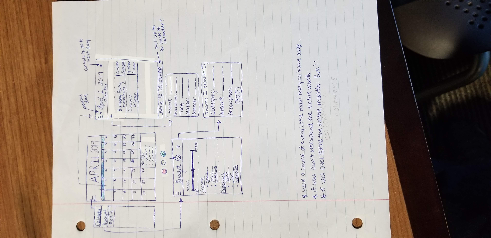

# Monthly-Planner

## Table of Contents
1. [Overview](#Overview)
1. [Product Spec](#Product-Spec)
1. [Wireframes](#Wireframes)
2. [Schema](#Schema)

## Overview
### Description
[App to organize budget, plan events, and set goals]

### App Evaluation
[Evaluation of your app across the following attributes]
- **Category:** Productivity/Organizer
- **Mobile:** Does not require internet access, push notifications for reminders
- **Story:** Planning out your month in advance, combined with keeping track with changes as you go, increases productivity
             and can help
- **Market:** The size of the productivity market is massive. People everywhere are lookng to optimize their lives. This product provides
              a huge value to those who need a push to keep to their schedules, finances, and goals.
- **Habit:** This app is designed to be used daily by users. The budget feature alone will require daily input as people input what they 
             spend. The user will also need to open the app to plan the app with the calendar and view their daily schedules. 
- **Scope:** The scope of the overall idea of this project is too big to be finished by the end of the program, but a stripped down version
             with the basic user stories will still be interesting to build. Our group has a very clear understanding of what we want to accomplish.

## Product Spec

### 1. User Stories (Required and Optional)

**Required Must-have Stories**

* User can add and delete events from Calendar
* User can add and delete income and expenses from Budget
* User can select day on Calendar to see schedule
* User can see a list of income and expenses with amount of money remaining

**Optional Nice-to-have Stories**

* User can authenticate with google
* User can connect Calendar to Google Calendar and edit events
* User can divide expenses and income by categories
* User can enable notifications for Calendar events

### 2. Screen Archetypes

* Calendar
   * User can see overview for current month. They can tap on a day to see days events
   * ...
* Days events
   * Shows schedule for the day. Can press the add button to add an event
   * ...
* Add event
  * Can put in description and other details of an event. It will added to daily schedule.
* Budget 
  * Can see overall amount left of budget and list of income and expenses
* Add Income/Expense

### 3. Navigation

**Tab Navigation** (Tab to Screen)

* Calendar
* Budget

**Flow Navigation** (Screen to Screen)

* Calendar
   * Daily Schedule
* Daily Schedule
   * Calendar
   * Add Events
* Budget
  * Add Income/Expense

## Wireframes

### [BONUS] Digital Wireframes & Mockups

### [BONUS] Interactive Prototype

## Schema 
[This section will be completed in Unit 9]
### Models
[Add table of models]
### Networking
- [Add list of network requests by screen ]
- [Create basic snippets for each Parse network request]
- [OPTIONAL: List endpoints if using existing API such as Yelp]
